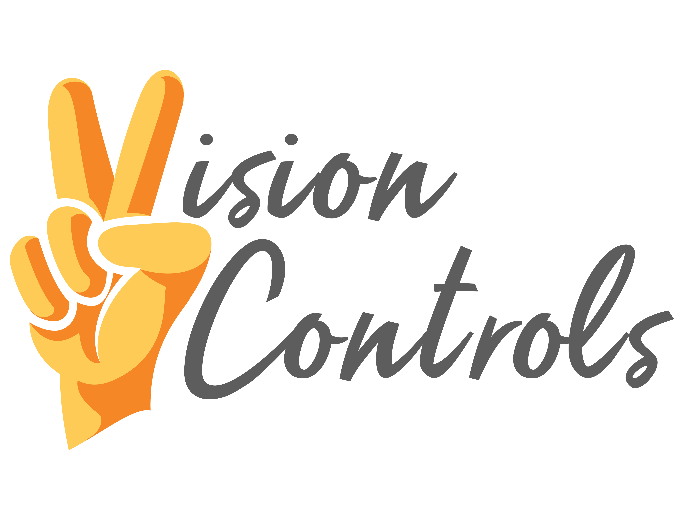
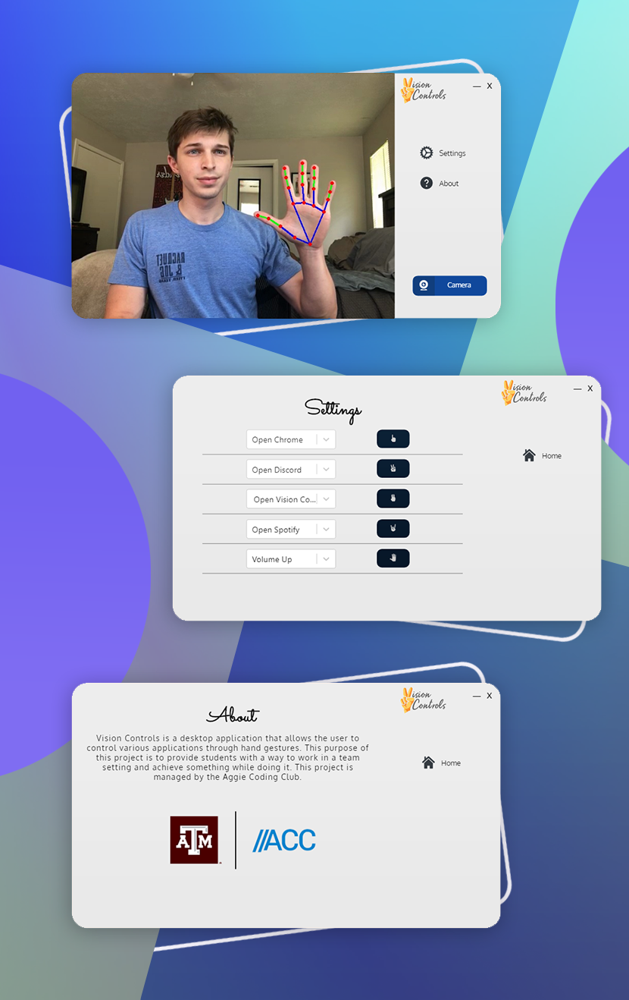

# Vision Controls
> Gesture Recognition Software.

## Table of contents
* [General info](#general-info)
* [Showcase](#screenshots)
* [Tech Stack](#tech-stack)
* [Setup](#setup)
* [Features](#features)
* [Extra](#extra)

## General info


Vision Controls is a desktop application that allows the user to control various applications through hand gestures.


## Showcase



## Tech Stack
**Frontend**

* JS
* React
* Electron

**Backend**

* Python
* Flask
* OpenCV

## Setup
General
```
git clone https://github.com/aggie-coding-club/Vision-Controls
cd Vision-Controls
npm install --global yarn
yarn install
```

Frontend
```
cd frontend
yarn start
npm run electron-start
```
Backend
```
pip install -r requirements.txt
python recognition/app.py
```

## Features
* Full Desktop UI Using React and Electron
* Gesture Recognition / mouse movement through Python with OpenCV 
* Settings page to change application preference / gestures

## Extra

This project is managed by Aggie Coding Club.

