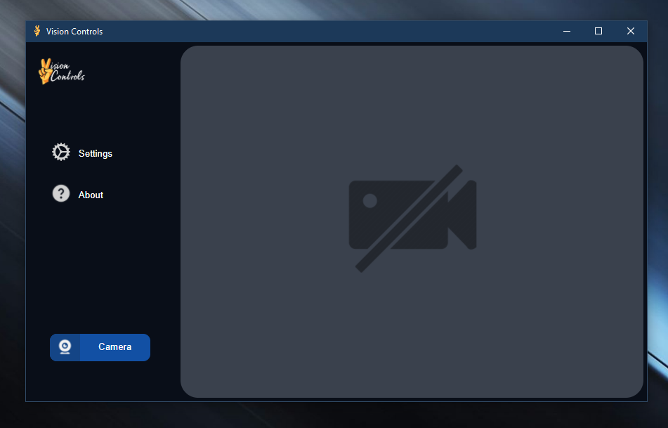
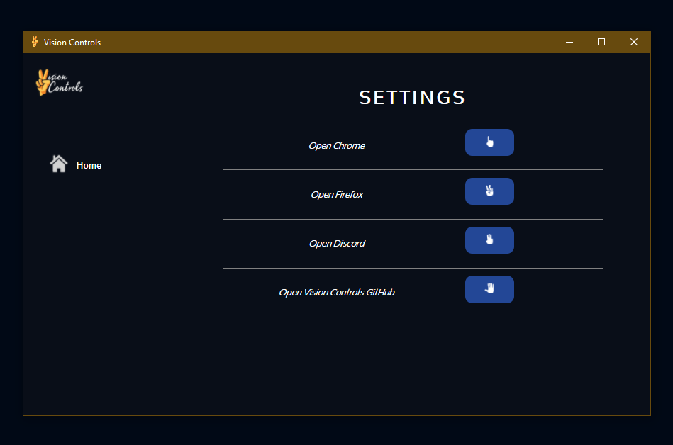
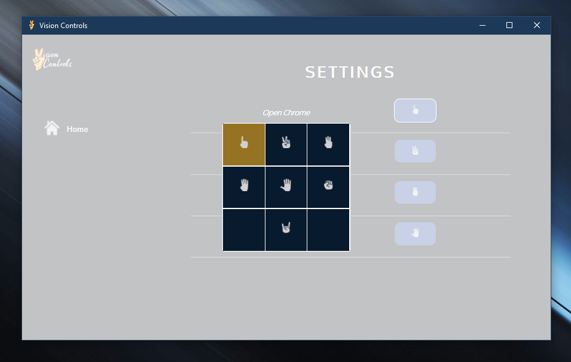

# Vision Controls
> Gesture Recognition Software.

## Table of contents
* [General info](#general-info)
* [Screenshots](#screenshots)
* [Technologies](#technologies)
* [Setup](#setup)
* [Features](#features)
* [Extra](#extra)

## General info


Vision Controls is a desktop application that allows the user to control various applications through hand gestures.


## Screenshots






## Technologies
* React
* Electron
* OpenCV

## Setup
1. Clone the repo
```sh
git clone https://github.com/aggie-coding-club/Vision-Controls
```
2. cd Vision-Controls

3. npm install --global yarn

4. cd front-end

5. yarn start

6. npm run electron-start (separate console)

## Features
* Full Desktop UI Using React and Electron
* Gesture Recognition through Python with OpenCV 
* Settings page to change application preference / gesture recognition

## Extra

This project is managed by Aggie Coding Club.

