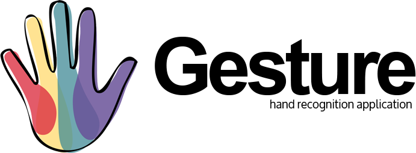

# Gesture
> Gesture Recognition Software.

## Table of contents
* [General info](#general-info)
* [Tech Stack](#tech-stack)
* [Setup](#setup)
* [Features](#features)
* [Extra](#extra)

## General info
<p align="center">
    
</p>
<p align="center" style="margin: 2vh">
    Gesture is a desktop application that allows the user to control various applications through hand gestures.
</p>


## Tech Stack
**Frontend**

* JS
* React
* Electron

**Backend**

* Python
* Flask
* OpenCV

## Setup
Installation

```
git clone https://github.com/aggie-coding-club/Vision-Controls
cd Vision-Controls
pip install -r requirements.txt
cd new-frontend
npm install
```
Once ready run **npm run dev** to launch application.

## Features
* Full Desktop UI Using React and Electron
* Gesture Recognition / mouse movement through Python with OpenCV 
* Settings page to change application preference / gestures

## Extra

This project is managed by Aggie Coding Club.

